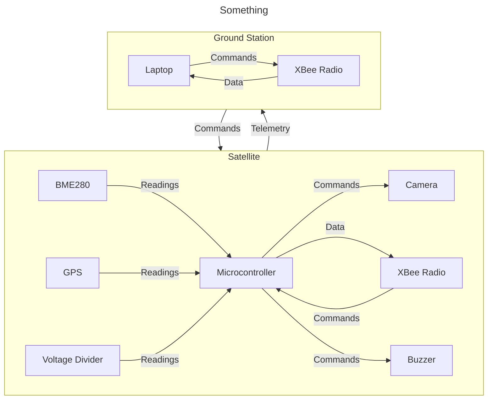
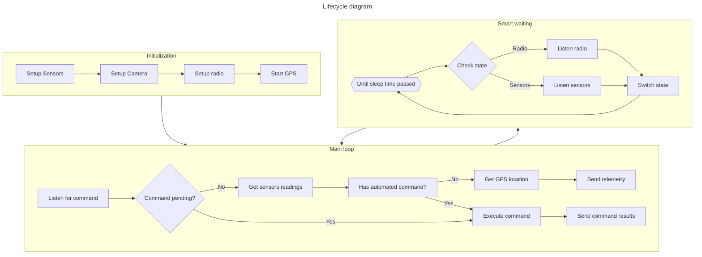
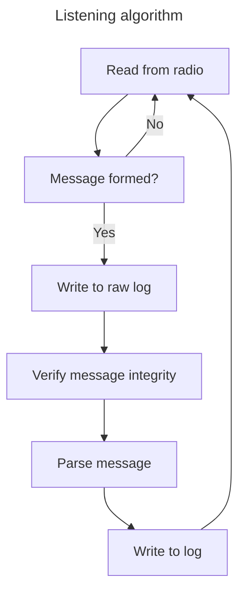

# CanSat Project

This repo contains software for CanSat competition where each team should build a small scale satellite alongside with a
ground
station for it. The software is built for a system consisting a satellite (i.e., Arduino microcontroller connected to a
set of devices) and a
ground station (a laptop connected to a radio module). Both parts communicate in both directions, and the communication
between them is built using XBee Radio modules.

Bidirectional communication is built for the following purposes:

- telemetry - the satellite reads values from its sensors and GPS, then sends it to the ground station;
- camera control - the ground station controls the recording on satellite's camera, the results are preserved in a
  micro-sd card on a camera;
- resetting the satellite or its parts - the ground station can command to reset readings or other parts in the
  satellite.

The communication between the satellite and the ground station is performed using XBee Radio modules.
The messages sent between the parties respond to the following format: `{MESSAGE_TYPE}/{PAYLOAD}|{HASH}`, where:

- `MESSAGE_TYPE` - the message type's code, i.e. a command response or a telemetry;
- `PAYLOAD` - payload of the message, e.g. telemetry data;
- `HASH` - hash value of the `{MESSAGE_TYPE}/{PAYLOAD}`.

The integrity of the messages is verified using a custom hash function.

Table of content:

* [Telemetry](#telemetry)
* [Satellite](#satellite)
* [Ground Station](#ground-station)

## Telemetry

The telemetry is a collection of readings from sensors, including GPS, with a goal of sending to the ground station. The
satellite collects metrics into telemetry messages, sends them to the ground station, and the ground station logs them
into a permanent storage.

The telemetry is collected from the following sensors which provide different metrics:

- BME280: temperature, pressure, humidity, altitude, speed (calculated from altitude change);
- GPS: latitude, longitude, GPS time;
- Voltage divider: voltage.

_Readings from sensors are passed through a 1 dimensional Kalman Filter to reduce noises and get more consistent
values._

## Satellite

The satellite is an Arduino microcontroller connected to a number of devices:

- GPS - a GPS module for position and time readings;
- XBee Radio - a radio module that is used to communicate with the ground station;
- Camera - a device for recording and taking pictures with a micro-sd storage;
- Buzzer - a module to make noises to indicate different stages of software lifecycle or testing;
- BME280 - a humidity sensor that provides data on humidity, temperature, pressure, altitude;
- Voltage divider - a modulo that provides data on the current voltage, used to measure the battery life.

The software for the satellite is written in C++17 and intended for Arduino microcontroller. It consists of several
classes that implement Kalman filter, communicating with the ground station using XBee, receiving and executing
commands, reading values from sensors, and controlling the camera.
The lifecycle diagram can be found below.

Other than regular working mode, there is also a testing mode. In testing mode, the satellite follows another scenario
that allows to verify the working of all sensors, camera, GPS, etc.

## Ground Station

The ground station is a laptop connected to an XBee Radio module. Its software is written as Python 3.6 console
applications, with different scripts for listening (`listen.py`) and sending commands (`send.py`).

The script for listening constantly listens output of the XBee Radio module for the messages, parses and verifies the
telemetry and command response messages, and logs them in two files:

- `raw_log.txt` - for messages that have been just read;
- `log.txt` - after parsing and verifying integrity.

The examples of log files are available as [raw_log.txt.example](./ground_station/raw_log.txt.example)
and [log.txt.example](./ground_station/log.txt.example).

The script for sending commands encodes the requested commands into a specific format and sends it using the XBee Radio
module. The script can run in two modes:

- sending a single command - by providing `--command=` (and possibly `--times=` and `--step=`) arguments;
- interactively sending commands - by constantly asking which command to send.

